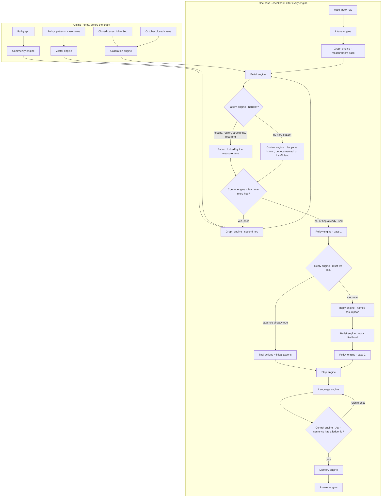

# Engines

One case moves through these engines in order. An engine receives one object and emits the next. It does not reach back and redo another engine’s job. LangGraph only checkpoints between them.

Offline engines run once, before `HHG-001`. The case engines run once per exam case, in case-id order, so a later case can see an earlier one in the graph.

## What crosses each arrow

| From | To | The object |
| --- | --- | --- |
| Calibration | Belief | Frozen map from risk score to probability, plus a likelihood ratio per finding |
| Community | Second hop | Louvain id and FastRP vector already stored on the card |
| Vector | Second hop | Policy paragraph and old-case notes, only if that hop is chosen |
| Intake | Measurement pack | `trigger_type`, transaction id, card id, customer id |
| Measurement pack | Belief | Claims with real ids: window, device, region, monthly repeat, old cases |
| Belief | Pattern | `p`, which evidence families fired, contradiction flag |
| Pattern | Hop question | One of the seven pattern names, locked by code when a hard detector fired |
| Second hop | Belief | New claims only. Belief adds their likelihood ratios. It does not restart the case |
| Policy pass 1 | Reply | `initial` actions, routes, and whether a customer ask is still legal |
| Reply | Belief | One assumption: confirm, deny, no reply, or monthly-charge dispute |
| Policy pass 2 | Stop | `final` actions. `FILE_REPORT` and `sar.file` are the same bit |
| Stop | Language | `stop_reason` plus the ledger. The writer does not get the raw CSVs |
| Language | Jev | Draft sentences, each tied to one evidence `ref` |
| Memory | Answer | The case vertex read back from TigerGraph. `written_to_graph` is set here |
| Answer | `cases/HHG-xxx.json` | Schema only. This engine does not think |

## What each engine is allowed to decide

| Engine | Decides | Does not decide |
| --- | --- | --- |
| Calibration | How much a bank score and a finding should move `p` | Any exam case. October is the check, then the table is frozen |
| Community | Which cards sit together, computed once | Whether this charge is fraud |
| Vector | Which policy sentence to show the writer | The action |
| Intake | Nothing. It types the alert | The verdict |
| Graph | Facts: counts, ids, times, device string | Block, report, or pattern name |
| Belief | `p` from the frozen ratios | The action. An old case can move the prior only |
| Pattern | The enum. Hard detectors beat Jev | The block. Recurring match locks the R7 path |
| Jev | Second hop or not. Unnamed pattern when nothing hard fired. Whether a sentence is supported | `BLOCK_CARD`, the probability, the ids |
| Policy | Actions, approval route, report yes or no, in R1–R10 order | A new fact |
| Reply | The assumed customer line, from the ledger | A free-text story |
| Stop | The sentence in `stop_reason` | A new action |
| Language | Wording of the summary and the report | Numbers and ids |
| Memory | That the vertex matches the case we just built | A nicer verdict on the way out |
| Answer | That the JSON matches the README | Anything else |
| LangGraph | Resume after a crash. One ask. One hop. One rewrite | Every row above |
