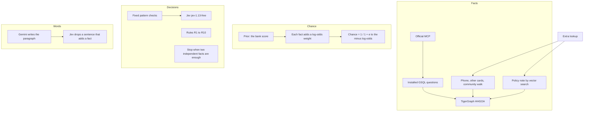
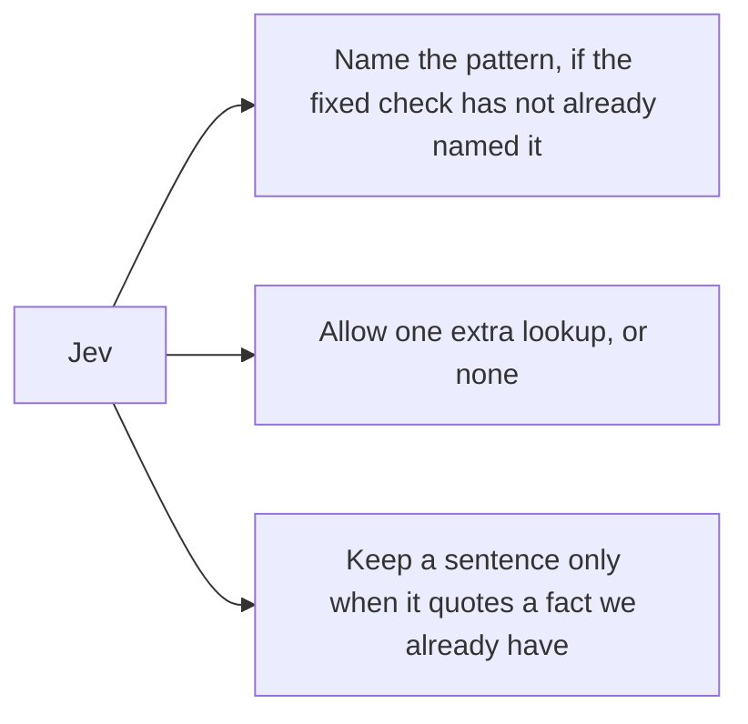
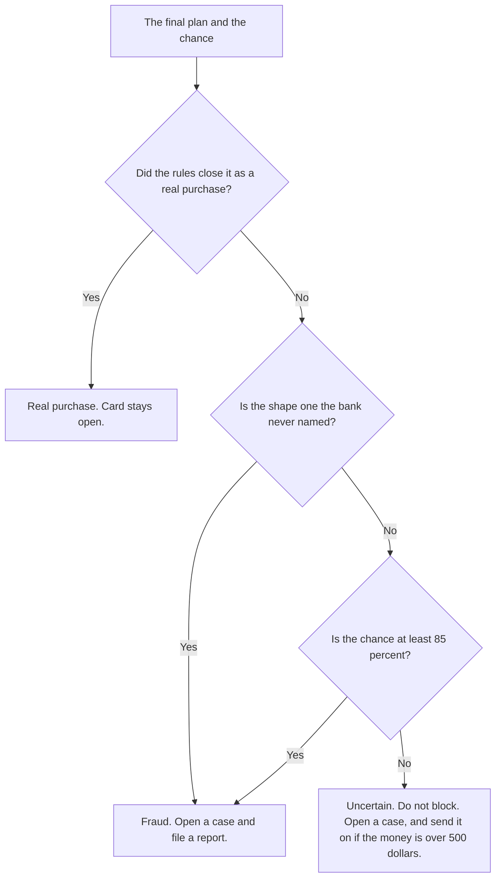
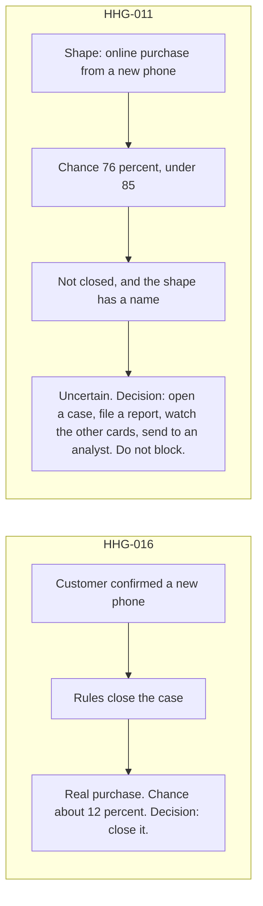

# Demo script

Open the desk at http://localhost:5173/ before you start. HHG-011 and HHG-016 are already under Investigated. Open them. Do not press Investigate on a case that is still under New alerts.

Say the words below out loud. The first part is the picture. The second part is the two cases.

## 1. The picture

One case, left to right. Each box has one job.

```mermaid
flowchart LR
  alert["Alert"] --> pack["Graph pack"]
  pack --> bayes["Bayesian chance"]
  bayes --> shape["Pattern match"]
  shape --> hop["One extra lookup"]
  hop --> rules1["Rules, first plan"]
  rules1 --> reply["One assumed answer"]
  reply --> rules2["Rules, final plan"]
  rules2 --> commit["What it rests on"]
  commit --> prose["Note"]
  prose --> sign["Signature"]
  sign --> memory["Save and read back"]
```

Who is allowed to touch each box.

Jev is asked three things only.

The bucket is chosen after the plan is finished. Three questions, in this order. A named pattern does not skip them.

Where the two demo cases land, and the decision on each.

## 2. Say this while the picture is up

The brief asks for an agent that starts from a trigger, gathers evidence, lives with uncertainty, asks for more only when the policy allows it, recommends the next actions, explains why, and writes the case into memory. That is the first picture, left to right.

Then the bucket picture. After the plan is written, three questions pick the word on the case. First, did we close it as a real purchase? If yes, that is the bucket, and the card stays open. If no, is the shape one the bank never named? If yes, it is fraud, even when the chance is under 85 percent. If the shape has a name, or has no name at all, is the chance at least 85 percent? If yes, fraud. If no, it stays uncertain. We do not block an uncertain case.

HHG-016 takes the first door. The assumed answer is yes, that was my new phone. The rules close it. The chance is about 12 percent. The decision is close it.

HHG-011 does not take that door. We did not close it. The shape has a name, an online purchase from a new phone, so it is not the unnamed fraud door. The chance is 76 percent, under 85. So the bucket is uncertain. The decision is open a case, file a report, watch the other cards, and send it to an analyst. The card is not blocked.

An alert comes in. The dataset has three triggers, and we take all three: a customer saying the charge was not theirs, a risk score from the bank, or an analyst. There is no fraud flag on the transaction. We open that one row. No model has been asked yet.

The evidence comes from TigerGraph, not from a model guessing. The official MCP server is the only door. The questions are installed GSQL, the same pack on every case: the flagged charge, the card’s history, the phone and whether it is new, the other cards on that phone, the region, a repeating monthly amount, older cases, and the money at risk. That is the knowledge graph, the transaction history, the device and identity signal, the account behavior, and the prior cases. Jev cannot skip that pack. If it could, we might miss tiny test charges or a shared phone.

Then the chance. This is a Bayesian update. The prior is the bank’s own score. Each finding adds a frozen log-odds weight, up for a worrying fact and down for a reassuring one. The percent on the screen is one divided by one plus e to the minus that total. The dashed line at 70 percent means one weak sign is not enough to block a card.

Next, pattern match. Fixed checks look for the known shapes: tiny test charges, an online purchase from a new phone, an online purchase that may be stolen, a purchase far from home, someone else on the account, and a shape the bank never named. If a check locks a name, Jev is not asked to rename it. If nothing locks, Jev, jev-1.13-free, names it from a short list and returns a chance for each choice. If the top two are too close, we do not force a name.

Then one extra lookup, or none. This is the controlled ask for more evidence. Jev may ask for the other cards on this phone, a walk of the cards that share a small device, the older cases again, or the closest policy note. That note is GraphRAG: a vector search inside TigerGraph over the fraud policy and the pattern notes. We pass that short passage to the writer with the graph facts. We do not hand it the raw 590,000 rows. The passage is context. It is not a new fact about this charge. One lookup. Then we stop walking. If we still need a person, the policy allows one assumed customer answer, a stronger check, or a handoff to an analyst. We do not keep asking.

The rules write the first plan. R1 through R10. They are code. A dispute that matches a monthly payment is checked before any block. Jev does not pick block, decline, or report.

If we still need the customer, we assume one answer from the facts. The writing model does not invent that answer. The rules run a second time. Both plans stay on the case. We also keep the other answers, marked as not what happened, so you can see what a yes or a no would have done.

We stop when the chance is clearly high or clearly low and we have two different kinds of evidence, or when that one answer settles it. We then name the fact the decision rests on: drop that family, rerun the rules, and the actions change. Drop another family and they do not.

Gemini writes the paragraph from those facts, and from the policy note when we retrieved one. The challenge asks the language model to explain, not to replace the graph. So Gemini does not choose the pattern, the chance, or the action. Jev reads each sentence. A sentence that adds a fact is dropped. A bank report is written only when the rules already asked for one.

A block, a decline, or a report waits for a person. That is the permission line. The agent may recommend. Only the automatic actions run on their own: open a case, watch a card, warn, or close a clean purchase. We do not text a real customer, freeze a real card, refund anyone, or update a real CRM. The case file is that record. The challenge allows those bank actions to be simulated, and this screen is the simulation.

Last, we save the verdict and the money at risk in TigerGraph and read them back. They count only when the two copies match. The next case can see this one. The answer file keeps both action lists: the plan before any extra evidence, and the plan after. The checklist is LangGraph. It saves its place after each step, so a crash does not ask the customer twice and does not walk the graph a second time.

## 3. Say this while you click

**On the board.** This is the case desk. Twenty alerts, the same ones every team is judged on. The finished ones are under Investigated. I will open two. HHG-011 is the uncertain one: we name the pattern, we say we are not sure, and the next action is a case and a report, not a block. HHG-016 is the one where new evidence changes the plan: we were going to ask the customer, and after the assumed yes we close it.

**Open HHG-011.** Read the customer’s line. They say: I never made this $131.30 purchase. Please check my card.

Walk the ten steps. We opened that one alert. We looked up the card, the phone, and older cases. The shape is an online purchase from a new phone. We allowed one more lookup, the other cards on that phone, and then we stopped. The rules wrote a plan before any customer answer. We did not need to ask them. The facts were already enough, so the final plan is the same plan. The note is written from those facts. The report needed a manager, and it is already signed. The card is not blocked. The case was saved as EXAM-HHG-011, and the read-back matched.

Then the gold line. We are not sure yet. Seventy-six percent. That leans toward fraud, and it is not sure enough to block the card. Your part is finished. You signed the report. On its own the agent will open a case, watch the other cards, and send this to an analyst.

The report box is only their words, and the purchase they asked about: $131.30 on 29 December 2016.

Now How this report was built. This is this charge, not a sample.

The pattern bars: an online purchase from a new phone matched. Tiny test charges did not. A stolen-card purchase did not. A purchase far from home did not. Someone else using the account did not. An unnamed shape did not. So the fixed check locked the name, and Jev was not asked to rename it.

The line under that is the Bayesian update for this charge. It starts at the bank’s score, 39 percent. A phone we have not seen lifts it to 56. That phone showing up in an older fraud case lifts it to 83. A long quiet history on the card brings it back to 76. The dashed line is 70 percent. We stay under a block.

The chips are the graph. Card C11923-K2, this phone, and two other cards on it, C05595-K1 and C05678-K1. Ten thousand earlier charges on this card were read. Five older cases helped the search. They do not prove this charge.

Jev, jev-1.13-free, was still in the loop for its three checks. The pattern was already named. The extra lookup on file is those other cards. A check Jev did not answer is recorded. The backup did not choose the actions. The rules did. R6 applied, because this phone is tied to an older confirmed fraud. R8 applied, because we are still unsure and the money at risk is over $500. The other eight rules were checked and did not apply. About $642 is at risk. What we will do is open a case, file a report, watch the other cards, and send it to an analyst. The report says a manager approved it.

The earlier plan is the same list. It is not a second task. What this decision rests on is the phone. If we ignore the phone, the actions change.

**Go back. Open HHG-016.** This one looks like the customer’s own spending. The first plan was to ask them and open a case. From the facts we assume one answer: yes, that was me, it is a new phone. Watch the chance line. That confirmation is the step that pulls the chance down, to about 12 percent. The final plan is to close it. No money is at risk. Nothing is waiting for a signature. No customer was texted, and no card was blocked. Closing the case on this screen is the simulation the challenge allows.

**How this works**, the button beside Alerts, is the general page. It names Jev and the three checks, the ten steps, an example of the chance line, and all ten rules in plain words. The case you just opened is the live one. That page is the key.

**Close.** Twenty cases are saved this way. The unsure ones stay open, with a next action that does not pretend we are sure. The clean ones close after the assumed answer changes the plan. A block, a decline, or a report waits for a person. Then the verdict is written into TigerGraph and read back, so the next investigation can use it.

If you need one sentence on the approach, say this. The graph finds the facts. A Bayesian update turns those facts into a chance. Fixed checks name the pattern, and Jev speaks only when they do not. The rules pick the actions, twice, before and after one controlled piece of extra evidence. Gemini explains. A person signs the serious actions. TigerGraph keeps the case.
